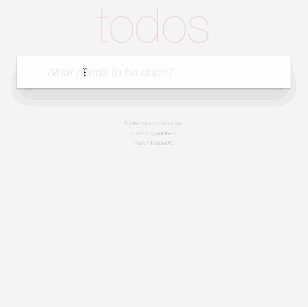

# 11/25/15

___This homework is due by 8am, on 11/30/2015___

# Build a Todo application with React

## Description
Using React, build a Todo application. The application should allow you to enter in new todo items (text), and list those todo items out immediately below and have it be available again when you refresh your page.

## Objectives

### Learning Objectives

After completing this assignment, you should...

* Understand how React state works.
* Understand how to build out React events.
* Understand how to use all of the REST verbs.

## Normal Mode
* Replicate the following behavior using React.
* You should be able to mark an item as completed.
* You should be able to remove an item from the list (completed or not).
* You should add filters for 
  - All Items (completed or not)
  - Completed items
  - Active items 
* You should have a button to remove all completed items from the list.
* You should store all todos in a parse.com database and load them on page load.

Example

### Deliverables

- Fork this repo and provide a link to either ghpages or surge.